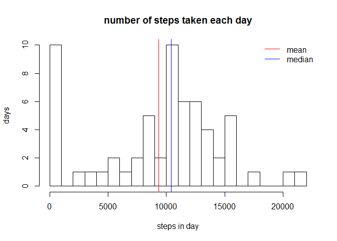
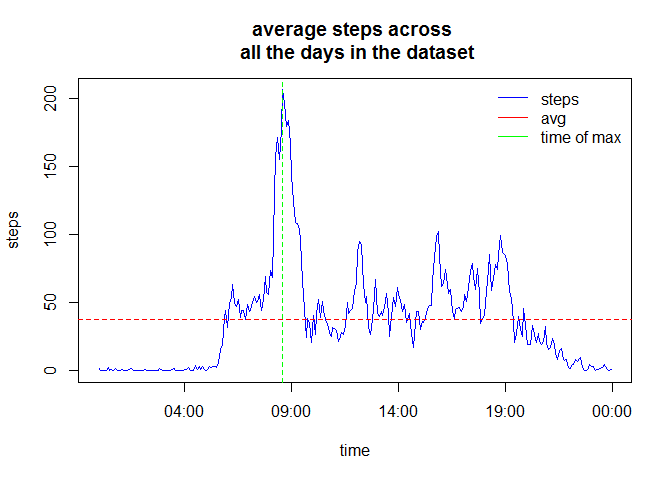
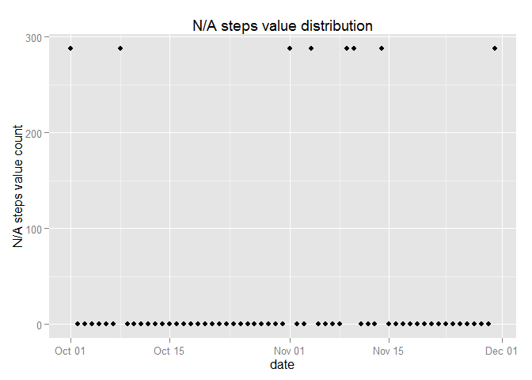
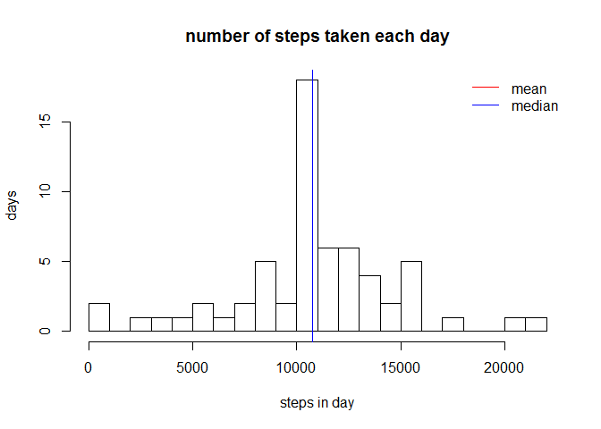
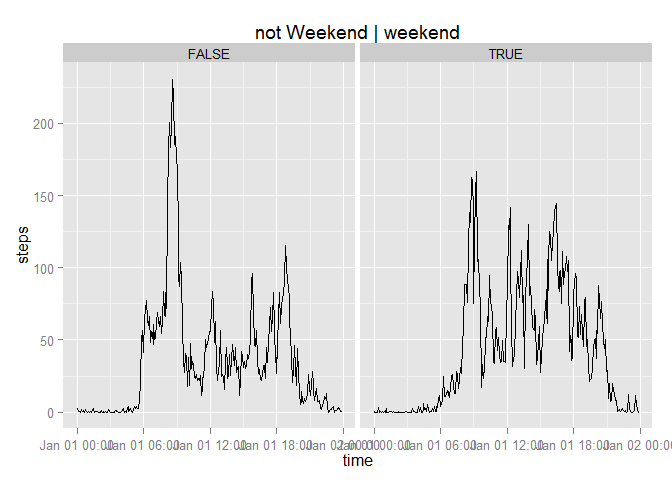

# Reproducible Research: Peer Assessment 1
### Environment info

```r
setwd("C:/Data/Coursera/repdata-010/RepData_PeerAssessment1")
rversion <- R.Version()$version.string
sysname <- Sys.info()["sysname"]
sys.release <- Sys.info()["release"]

# libraries:
library(dplyr) 
```

```
## 
## Attaching package: 'dplyr'
## 
## The following object is masked from 'package:stats':
## 
##     filter
## 
## The following objects are masked from 'package:base':
## 
##     intersect, setdiff, setequal, union
```

```r
library(ggplot2)
```
R version 3.1.2 (2014-10-31)  
OS Version: Windows, 7 x64

## Loading and preprocessing the data

```r
#check have we loaded data:
if (!file.exists("data")) {     
  dir.create("data")  
}

fileUrl <- "https://d396qusza40orc.cloudfront.net/repdata/data/activity.zip"
zip_filename <- "./data/activity.zip"
csv_filename <- "./data/activity.csv"

if (!file.exists(csv_filename)) {
  # if we have not CSV file and have not ZIP file - try to get  them from web    
  if (!file.exists(zip_filename))
    {
    
    download.file(fileUrl, destfile = zip_filename, method = "curl")
    }
  
  zip.file.ctime <- as.character(file.info(zip_filename)$ctime)
  
  # unzip and save to CSV file
  con <- unz(zip_filename, "activity.csv")
  f <- readLines(con)
  writeLines(f, file(csv_filename))
  close(con)
  
  
  dataSource.info <- paste0(csv_filename,"', has been unzipped from the file '", zip_filename, "', downloaded on ", zip.file.ctime, "")    
} else   
{
  dataSource.info <- paste0("local file '", csv_filename, "'");
}

activity <- read.csv(csv_filename)
```
Data source: ./data/activity.csv', has been unzipped from the file './data/activity.zip', downloaded on 2015-01-17 23:36:23

#### some  preprocessing

As we can see, in fact "interval" does not mean integer sequence, it is time mark in format HHMM, where HH is hours, and MM is minutes:  

```r
interval_distinct_count <- dim(table(activity$interval))
minutes_in_day = 60*24

ts <- paste0("000", activity$interval)
activity$time <- as.POSIXct(strptime(paste0("01/01/2012",substr(ts, nchar(ts)-3, nchar(ts))), "%d/%m/%Y %H%M"))

activity[10:15,]
```

```
##    steps       date interval                time
## 10    NA 2012-10-01       45 2012-01-01 00:45:00
## 11    NA 2012-10-01       50 2012-01-01 00:50:00
## 12    NA 2012-10-01       55 2012-01-01 00:55:00
## 13    NA 2012-10-01      100 2012-01-01 01:00:00
## 14    NA 2012-10-01      105 2012-01-01 01:05:00
## 15    NA 2012-10-01      110 2012-01-01 01:10:00
```
Total distinct count of interval values is 288 and 2*288 is equal minutes in day count 1440  


## What is mean total number of steps taken per day?

#### Histogram of the total number of steps taken each day    


```r
# (We can find it by several ways)
# split activities by date and calculate steps count for every date
steps.per.day <- summarise(group_by(activity, date), steps = sum(steps, na.rm = TRUE))

mean.per.day <- mean(steps.per.day$steps);
median.per.day <- median(steps.per.day$steps);

hist(steps.per.day$steps, breaks = 20, xlab = "steps in day", ylab = "days", main = "number of steps taken each day")
abline(v = mean.per.day, col = "red", lty = 1)
abline(v = median.per.day, col = "blue", lty = 1)
legend("topright", bty="n", col = c("red", "blue"), legend = c("mean", "median"),
     lty=c(1,1,1), 
     lwd=c(1,1,1)) 
```

 
  
#### Calculate and report the mean and median total number of steps taken per day   
Mean of total number of steps taken per day is 9354.2295082
Median of total number of steps taken per day is 10395

## What is the average daily activity pattern?

Time series plot  of the 5-minute interval (x-axis) and the average number of steps taken, averaged across all days (y-axis)  

```r
steps.by.interval <- summarise(group_by(activity, time, interval), steps = mean(steps, na.rm = TRUE))
max.avg.steps <- max(steps.by.interval$steps)
max.interval <- filter(steps.by.interval, steps == max.avg.steps)

plot(x = steps.by.interval$time, y = steps.by.interval$steps, type="l", col = "blue", xlab = "time", ylab = "steps", main = "average steps across \n all the days in the dataset")
abline(h = mean(steps.by.interval$steps), col = "red", lty = 2)
abline(v = max.interval, col = "green", lty = 2)
legend("topright", bty="n", col = c("blue", "red", "green"), legend = c("steps", "avg", "time of max"),
     lty=c(1,1,1), 
     lwd=c(1,1,1)) 
```

 
   
5-minute interval, which contains the maximum number of average steps across all the days is 835 (r max.interval$time)  
maximum number of avarage steps across all the days is 206.1698113

## Imputing missing values

Total NAs by column:

```r
apply(activity, 2, function(x) {sum(is.na(x))})
```

```
##    steps     date interval     time 
##     2304        0        0        0
```

```r
steps.NAs <- sum(is.na(activity$steps))
steps.NA.percent <- format(mean(is.na(activity$steps))*100, digits = 4)
```
Total number of rows with NAs: 2304 (13.11 %)


```r
na.by.date <- summarise(group_by(activity, date), NA_steps = sum(is.na(steps)))
qplot(x = as.POSIXct(na.by.date$date), y = na.by.date$NA_steps, xlab = "date", ylab = "N/A steps value count", main = "N/A steps value distribution")
```

 

As we can see, we have 8 days without any measures.
Let's fill this values by average steps count per intervals accross all aviable date

```r
NA.date.list <- filter(na.by.date, NA_steps > 0)$date

xx <- data.frame (date = rep(NA.date.list, each = nrow(steps.by.interval)), steps.by.interval)

activity.processed <- activity;
for (i in NA.date.list){ 
 activity.processed[activity.processed$date == i,]$steps <- steps.by.interval$steps
 } 


steps.per.day.p <- summarise(group_by(activity.processed, date), steps = sum(steps, na.rm = TRUE))

mean.per.day.p <- mean(steps.per.day.p$steps);
median.per.day.p <- median(steps.per.day.p$steps);

hist(steps.per.day.p$steps, breaks = 20, xlab = "steps in day", ylab = "days", main = "number of steps taken each day")
abline(v = mean.per.day.p, col = "red", lty = 1)
abline(v = median.per.day.p, col = "blue", lty = 1)
legend("topright", bty="n", col = c("red", "blue"), legend = c("mean", "median"),
     lty=c(1,1,1), 
     lwd=c(1,1,1)) 
```

 
  
####After processing: the mean and median total number of steps taken per day   ()
Mean of total number of steps taken per day is 1.0766189\times 10^{4}
Median of total number of steps taken per day is 1.0766189\times 10^{4}


## Are there differences in activity patterns between weekdays and weekends?


```r
activity.processed$w <- weekdays(as.POSIXct(activity.processed$date)) %in% c("Saturday", "Sunday")
steps.by.interval <- summarise(group_by(activity.processed, time, interval, w), steps = mean(steps, na.rm = TRUE))

qplot(x = time, y = steps, data = steps.by.interval,  facets = .~w, geom = "line", main = "not Weekend | weekend")
```

 

