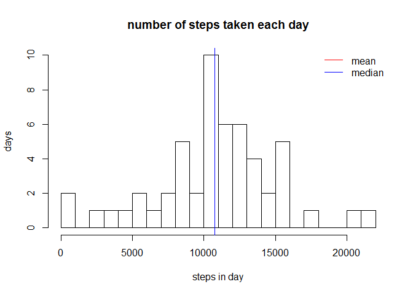
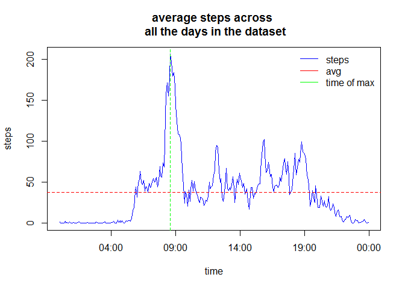
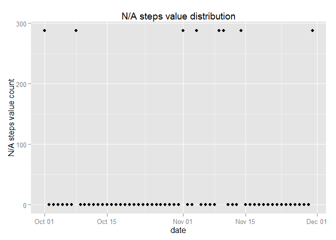
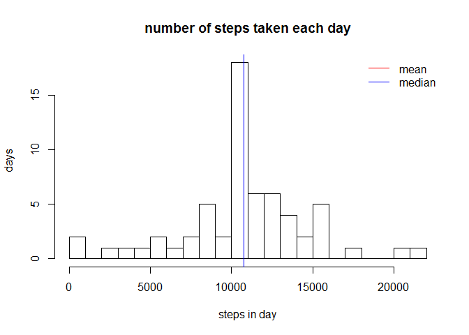
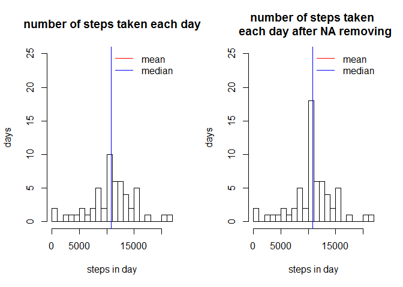
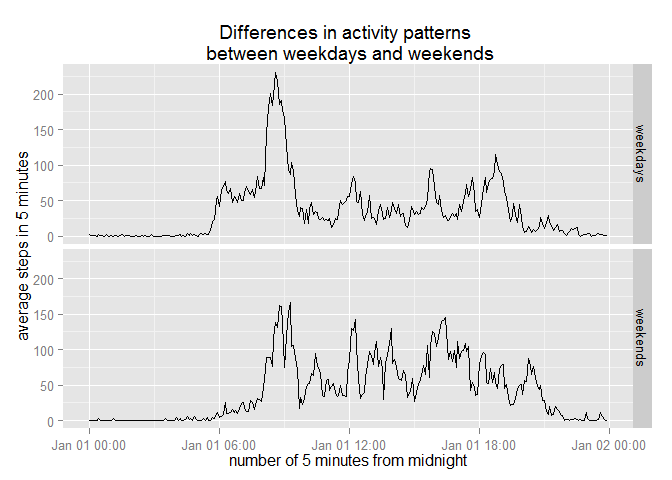

# Reproducible Research: Peer Assessment 1

## Summary

This is an exploratory analysis of data about personal movement using activity monitoring devices for homework assignment of ["Reproducible Research" course](https://www.coursera.org/course/repdata) taught by *Roger D. Peng* at <http://coursera.org>. 

This assignment makes use of data from a personal activity monitoring device. This device collects data at 5 minute intervals through out the day. The data consists of two months of data from an anonymous individual collected during the months of October and November, 2012 and include the number of steps taken in 5 minute intervals each day.


### Data

```r
fileUrl <- "https://d396qusza40orc.cloudfront.net/repdata/data/activity.zip"
```

The data for this assignment can be downloaded from the course web site:

- Dataset: Activity monitoring data ["df"](https://d396qusza40orc.cloudfront.net/repdata/data/activity.zip) 


The variables included in this dataset are:

1. steps: Number of steps taking in a 5-minute interval (missing values are coded as NA)

2. date: The date on which the measurement was taken in YYYY-MM-DD format

3. interval: Identifier for the 5-minute interval in which measurement was taken

The dataset is stored in a comma-separated-value (CSV) file and there are a total of 17,568 observations in this dataset.


### Environment info

```r
setwd("C:/Data/Coursera/repdata-010/RepData_PeerAssessment1")
rversion <- R.Version()$version.string
sysname <- Sys.info()["sysname"]
sys.release <- Sys.info()["release"]

# set global markdown options:
library(knitr)
opts_chunk$set(echo = TRUE
              , fig.width = 7
              , fig.path="figure/")

# libraries:
library(dplyr) 
```

```
## 
## Attaching package: 'dplyr'
## 
## The following object is masked from 'package:stats':
## 
##     filter
## 
## The following objects are masked from 'package:base':
## 
##     intersect, setdiff, setequal, union
```

```r
library(ggplot2)
```
R version 3.1.2 (2014-10-31)  
OS Version: Windows, 7 x64

## Loading and preprocessing the data

```r
#check have we loaded data:
if (!file.exists("data")) {     
  dir.create("data")  
}

zip_filename <- "./data/activity.zip"
csv_filename <- "./data/activity.csv"

if (!file.exists(csv_filename)) {
  # if we have not CSV file and have not ZIP file - try to get  them from web    
  if (!file.exists(zip_filename))
    {
    
    download.file(fileUrl, destfile = zip_filename, method = "curl")
    }
  
  zip.file.ctime <- as.character(file.info(zip_filename)$ctime)
  
  # unzip and save to CSV file
  con <- unz(zip_filename, "activity.csv")
  f <- readLines(con)
  writeLines(f, file(csv_filename))
  close(con)
  
  
  dataSource.info <- paste0(csv_filename,"', has been unzipped from the file '", zip_filename, "', downloaded on ", zip.file.ctime, "")    
} else   
{
  dataSource.info <- paste0("local file '", csv_filename, "'");
}

activity <- read.csv(csv_filename)
```
Data source: ./data/activity.csv', has been unzipped from the file './data/activity.zip', downloaded on 2015-01-17 23:36:23  
There are a total of 17568 observations of 3 variables in this dataset

#### some  preprocessing

As we can see, in fact "interval" does not mean integer sequence, it is time mark in format HHMM, where HH is hours, and MM is minutes:  

```r
interval_distinct_count <- dim(table(activity$interval))
minutes_in_day = 60*24

ts <- paste0("000", activity$interval)
activity$time <- as.POSIXct(strptime(paste0("01/01/2012",substr(ts, nchar(ts)-3, nchar(ts))), "%d/%m/%Y %H%M"))

activity[10:15,]
```

```
##    steps       date interval                time
## 10    NA 2012-10-01       45 2012-01-01 00:45:00
## 11    NA 2012-10-01       50 2012-01-01 00:50:00
## 12    NA 2012-10-01       55 2012-01-01 00:55:00
## 13    NA 2012-10-01      100 2012-01-01 01:00:00
## 14    NA 2012-10-01      105 2012-01-01 01:05:00
## 15    NA 2012-10-01      110 2012-01-01 01:10:00
```
Total distinct count of interval values is 288 and 2*288 is equal minutes in day count 1440  


## What is mean total number of steps taken per day?

#### Histogram of the total number of steps taken each day    


```r
par(mfrow=c(1,1))
# (We can find it by several ways)
# split activities by date and calculate steps count for every date
steps.per.day <- summarise(group_by(activity, date), steps = sum(steps, na.rm = TRUE))
steps.per.day <- summarise(group_by(activity, date), steps = sum(steps))

mean.per.day <- mean(steps.per.day$steps, na.rm = TRUE);
median.per.day <- median(steps.per.day$steps, na.rm = TRUE);

hist(steps.per.day$steps, breaks = 20, xlab = "steps in day", ylab = "days", main = "number of steps taken each day")
abline(v = mean.per.day, col = "red", lty = 1)
abline(v = median.per.day, col = "blue", lty = 1)
legend("topright", bty="n", col = c("red", "blue"), legend = c("mean", "median"),
     lty=c(1,1,1), 
     lwd=c(1,1,1)) 
```

 
  
#### Calculate and report the mean and median total number of steps taken per day   
Mean of total number of steps taken per day is 10766.19  
Median of total number of steps taken per day is 10765

## What is the average daily activity pattern?

Time series plot  of the 5-minute interval (x-axis) and the average number of steps taken, averaged across all days (y-axis)  

```r
steps.by.interval <- summarise(group_by(activity, time, interval), steps = mean(steps, na.rm = TRUE))
max.avg.steps <- max(steps.by.interval$steps)
max.interval <- filter(steps.by.interval, steps == max.avg.steps)

plot(x = steps.by.interval$time, y = steps.by.interval$steps, type="l", col = "blue", xlab = "time", ylab = "steps", main = "average steps across \n all the days in the dataset")
abline(h = mean(steps.by.interval$steps), col = "red", lty = 2)
abline(v = max.interval, col = "green", lty = 2)
legend("topright", bty="n", col = c("blue", "red", "green"), legend = c("steps", "avg", "time of max"),
     lty=c(1,1,1), 
     lwd=c(1,1,1)) 
```

 
   
5-minute interval, which contains the maximum number of average steps across all the days is 835 (08:35)  
maximum number of avarage steps across all the days is 206.17

**Walking  increases from the early morning, peaks around 08:35  and then sharply drops after morning rush-hours**


## Imputing missing values

*1.Calculate and report the total number of missing values in the dataset (i.e. the total number of rows with NAs)*

Total NAs by column:

```r
apply(activity, 2, function(x) {sum(is.na(x))})
```

```
##    steps     date interval     time 
##     2304        0        0        0
```

```r
steps.NAs <- sum(is.na(activity$steps))
steps.NA.percent <- format(mean(is.na(activity$steps))*100, digits = 4)
```
**Total number of rows with NAs: 2304 (13.11 %)**


```r
na.by.date <- summarise(group_by(activity, date), NA_steps = sum(is.na(steps)))
qplot(x = as.POSIXct(na.by.date$date)
      , y = na.by.date$NA_steps
      , xlab = "date", ylab = "N/A steps value count"
      , main = "N/A steps value distribution")
```

 

As we can see, we have 8 days without any measures.

*2.Devise a strategy for filling in all of the missing values in the dataset. The strategy does not need to be sophisticated. For example, you could use the mean/median for that day, or the mean for that 5-minute interval, etc.*

Let's fill this values by average steps count per intervals accross all aviable date

*3. Create a new dataset that is equal to the original dataset but with the missing data filled in.*

```r
NA.date.list <- filter(na.by.date, NA_steps > 0)$date

xx <- data.frame (date = rep(NA.date.list, each = nrow(steps.by.interval)), steps.by.interval)

activity.processed <- activity;
for (i in NA.date.list){ 
 activity.processed[activity.processed$date == i,]$steps <- steps.by.interval$steps
 } 

steps.per.day.p <- summarise(group_by(activity.processed, date)
                             , steps = sum(steps, na.rm = TRUE))

mean.per.day.p <- mean(steps.per.day.p$steps);
median.per.day.p <- median(steps.per.day.p$steps);
```

####After processing: 

*4.Make a histogram of the total number of steps taken each day and Calculate and report the mean and median total number of steps taken per day. Do these values differ from the estimates from the first part of the assignment? What is the impact of imputing missing data on the estimates of the total daily number of steps?*


```r
hist(steps.per.day.p$steps
     , breaks = 20
     , xlab = "steps in day", ylab = "days"
     , main = "number of steps taken each day")
abline(v = mean.per.day.p, col = "red", lty = 1)
abline(v = median.per.day.p, col = "blue", lty = 1)
legend("topright", bty="n", col = c("red", "blue"), legend = c("mean", "median"),
     lty=c(1,1,1), 
     lwd=c(1,1,1)) 
```

 


- Mean of total number of steps taken per day is 10766.19. (Before processing was 10766.19)  
- Median of total number of steps taken per day is 10766.19 (Before processing was 10765)

The mean remains the same. The median becomes larger and moves closer to the mean.

These results are caused by imputing only mean number. Thus the distribution of total steps per day increases at the mean level, according to the following histograms

```r
par(mfrow=c(1,2))

hist(steps.per.day$steps
     , breaks = 20
     , xlab = "steps in day", ylab = "days"
     , main = "number of steps taken each day"
     , ylim = c(0,25))
abline(v = mean.per.day, col = "red", lty = 1)
abline(v = median.per.day, col = "blue", lty = 1)
legend("topright", bty="n", col = c("red", "blue"), legend = c("mean", "median"),
     lty=c(1,1,1), 
     lwd=c(1,1,1)) 

hist(steps.per.day.p$steps
     , breaks = 20
     , xlab = "steps in day", ylab = "days"
     , main = "number of steps taken \n each day after NA removing", ylim = c(0,25))
abline(v = mean.per.day.p, col = "red", lty = 1)
abline(v = median.per.day.p, col = "blue", lty = 1)
legend("topright", bty="n", col = c("red", "blue"), legend = c("mean", "median"),
     lty=c(1,1,1), 
     lwd=c(1,1,1)) 
```

 
  

## Are there differences in activity patterns between weekdays and weekends?
*1. Create a new factor variable in the dataset with two levels – “weekday” and “weekend” indicating whether a given date is a weekday or weekend day.*


```r
par(mfrow=c(1,1))

activity.processed$w <- 
    factor( 
            weekdays(as.POSIXct(activity.processed$date)) %in% c("Saturday", "Sunday")
          , labels = c("weekdays", "weekends")
          )
steps.by.interval <- summarise(group_by(activity.processed, time, interval, w)
                               , steps = mean(steps, na.rm = TRUE))


qplot(x = time
      , y = steps
      , data = steps.by.interval
      , facets = w ~ .
      , geom = "line"
      , main = "Differences in activity patterns \n between weekdays and weekends"
      , xlab="number of 5 minutes from midnight", ylab="average steps in 5 minutes",
      )
```

 

*Make a panel plot containing a time series plot (i.e. type = "l") of the 5-minute interval (x-axis) and the average number of steps taken, averaged across all weekday days or weekend days (y-axis). See the README file in the GitHub repository to see an example of what this plot should look like using simulated data.*

**During weekdays, the walking peaks in the moring around rush-hour at 8:35, then drops significantly lower after rush-hour. Walking in weekends more uniform distributed during the day.**
